<br>
<div align="center">
  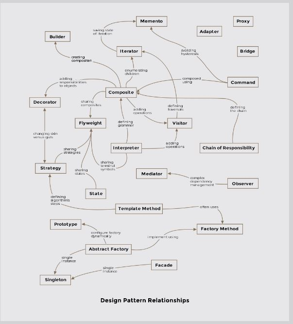
</div>
<br>

## Types of Design Patterns

### Creational

Creational design patterns relate to how objects are constructed from classes. New-ing up objects may sound trivial but unthoughtfully littering code with object instance creations can lead to headaches down the road. The creational design pattern come with powerful suggestions on how best to encapsulate the object creation process in a program.

* Builder Pattern
* Prototype Pattern
* Singleton Pattern
* Abstract Factory Pattern


### Structural

Structural patterns are concerned with the composition of classes i.e. how the classes are made up or constructed. These include:

* Adapter Pattern
* Bridge Pattern
* Composite Pattern
* Decorator Pattern
* Facade Pattern
* Flyweight Pattern
* Proxy Pattern

### Behavioral

Behavioral design patterns dictate the interaction of classes and objects amongst eachother and the delegation of responsibility. These include:

* Interpreter Pattern
* Template Pattern
* Chain of Responsibility Pattern
* Command Pattern
* Iterator Pattern
* Mediator Pattern
* Memento Pattern
* Observer Pattern
* State Pattern
* Strategy Pattern
* Visitor Pattern

# Creational Patterns

### Builder pattern

As the name implies, a builder pattern is used to build objects. Sometimes, the objects we create can be complex, made up of several sub-objects or require an elaborate construction process. The exercise of creating complex types can be simplified by using the builder pattern. A composite or an aggregate object is what a builder generally builds.

Formally, a <b>builder pattern encapsulates or hides the process of building a complex object and separates the representation of the object and its construction. The separation allows us to construct different representations using the same construction process. In Java speak, different representations implies creating objects of different classes that may share the same construction process.</b>

<br>
<div align="center">
  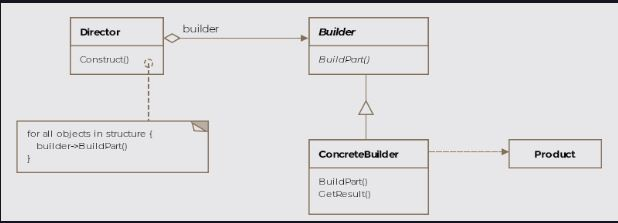
  <br>
  <code>Class Diagram</code>
</div>
<br>

### Singleton Pattern

Singleton pattern as the name suggests is used to create one and only instance of a class. There are several examples where only a single instance of a class should exist and the constraint be enforced. Caches, thread pools, registries are examples of objects that should only have a single instance.

Its trivial to new-up an object of a class but how do we ensure that only one object ever gets created? The answer is to make the constructor private of the class we intend to define as singleton. That way, only the members of the class can access the private constructor and no one else.

Formally the Singleton pattern is defined as <b>ensuring that only a single instance of a class exists and a global point of access to it exists.</b>

<br>
<div align="center">
  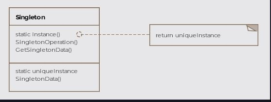
  <br>
  <code>Class Diagram</code>
</div>
<br>

<b>Other Examples</b>

* java.lang.Runtime
* java.awt.Desktop

### Prototype Pattern

Formally, the pattern is defined as specify the kind of objects to create using a prototypical instance as a model and making copies of the prototype to create new objects.

<br>
<div align="center">
  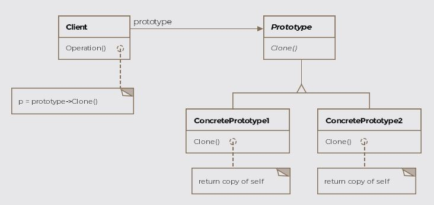
  <br>
  <code>Class Diagram</code>
</div>
<br>

<b>Other Examples</b>

* In Java the root Object class exposes a clone method. The class implements the interface java.lang.Cloneable

### Factory Method Pattern

A factory produces goods, and a software factory produces objects. Usually, object creation in Java takes place like so:

```java
SomeClass someClassObject = new SomeClass();
```

Formally, the factory method is defined as <code>providing an interface for object creation but delegating the actual instantiation of objects to subclasses.</code>

<br>
<div align="center">
  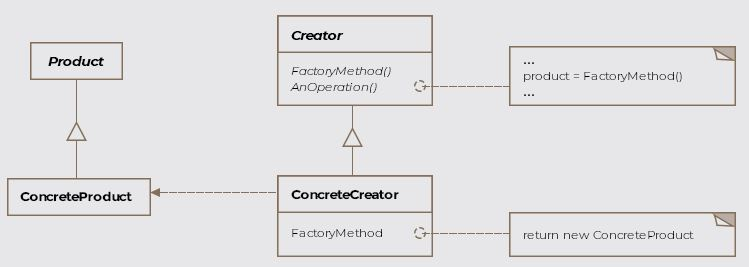
  <br>
  <code>Class Diagram</code>
</div>
<br>

<b>Other Examples</b>

* java.util.Calendar.getInstance()
* java.util.ResourceBundle.getBundle()
* java.text.NumberFormat.getInstance()

### Abstract Factory Pattern

Formally, the abstract factory pattern is defined as <b>defining an interface to create families of related or dependent objects without specifying their concrete classes.</b>

<br>
<div align="center">
  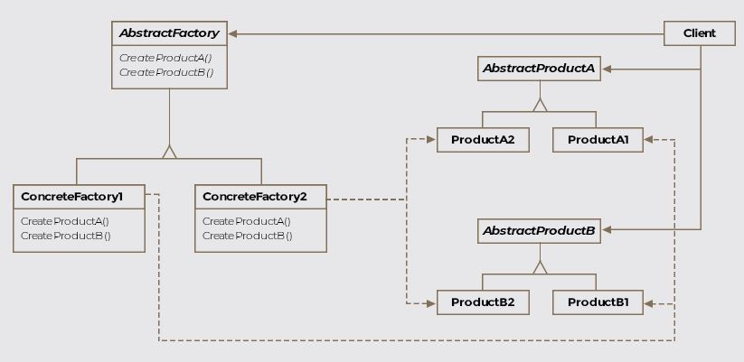
  <br>
  <code>Class Diagram</code>
</div>
<br>

<b>Other Examples</b>

* <code>javax.xml.parsers.DocumentBuilderFactory.newInstance()</code> will return you a factory.

* <code>javax.xml.transform.TransformerFactory.newInstance()</code> will return you a factory.

# Structural Patterns

allowing incompatible classes to work together by converting the interface of one class into another expected by the clients

<br>
<div align="center">
  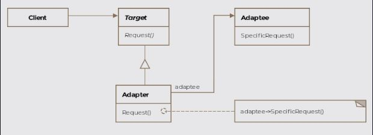
  <br>
  <code>Class Diagram</code>
</div>
<br>

* In the Java API, one can find <code>java.io.InputStreamReader</code> and <code>java.io.OutputStreamWriter</code> as examples of the adapter pattern

### Bridge Pattern

<code>the bridge pattern lets you vary the abstraction independently of the implementation, thus decoupling the two in the process.</code> However, the abstraction and the implementation in the definition don't mean Java's abstract class/interface and concrete classes respectively.

<br>
<div align="center">
  <br>
  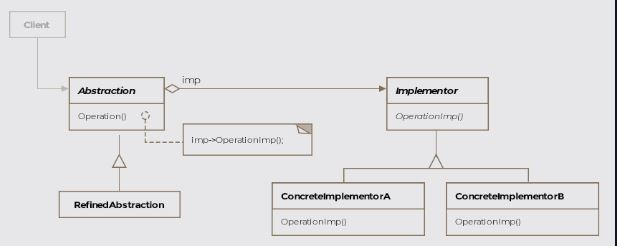
  <code>Class Diagram</code>
</div>
<br>

### Composite Pattern

the composite pattern is defined as <code>composing objects into tree structures to represent part-whole hierarchies, thus letting clients uniformly treat individual objects and composition of objects.</code>

<br>
<div align="center">
  <br>
  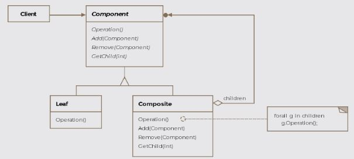
  <code>Class Diagram</code>
</div>
<br>

### Decorator Pattern

A decoration is added to something to make it more attractive, in the same spirit, the decorator pattern adds new functionality to objects without modifying their defining classes.

<br>
<div align="center">
  <br>
  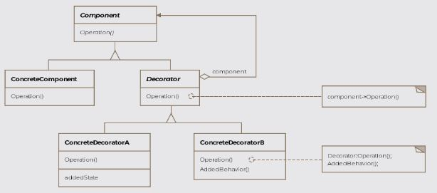
  <code>Class Diagram</code>
</div>
<br>

### Facade Pattern

<code> single uber interface to one or more subsystems or interfaces intending to make use of the subsystems easier.</code>

<br>
<div align="center">
  <br>
  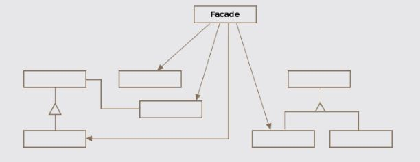
  <code>Class Diagram</code>
</div>
<br>

### Flyweight

<code>sharing state among a large number of fine-grained objects for efficiency.</code>

<br>
<div align="center">
  <br>
  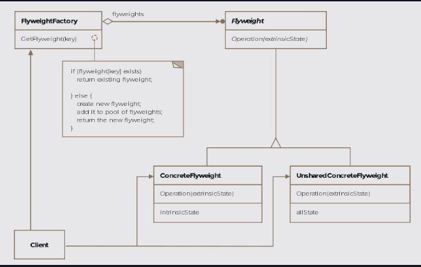
  <code>Class Diagram</code>
</div>
<br>

### Proxy Pattern

mechanism to provide a surrogate or placeholder for another object to control access to it.

<br>
<div align="center">
  <br>
  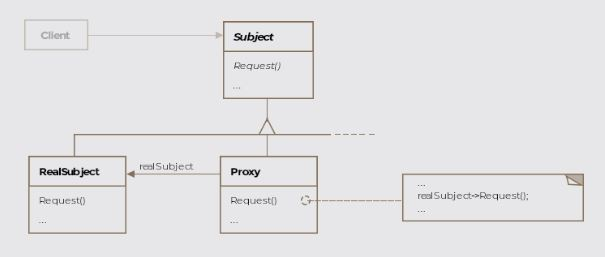
  <code>Class Diagram</code>
</div>
<br>

# Behavioral Patterns

### Chain of Responsibility Pattern

In a <code>chain of responsibility</code> pattern implementation, the sender's request is passed down a series of handler objects till one of those objects, handles the request or it remains unhandled and falls off the chain. Multiple objects are given a chance to handle the request. This allows us to decouple the sender and the receiver of a request.

Formally, the pattern is defined as <code>decoupling the sender of a request from its receiver by chaining the receiving objects together and passing the request along the chain until an object handles it.</code>

<br>
<div align="center">
  <br>
  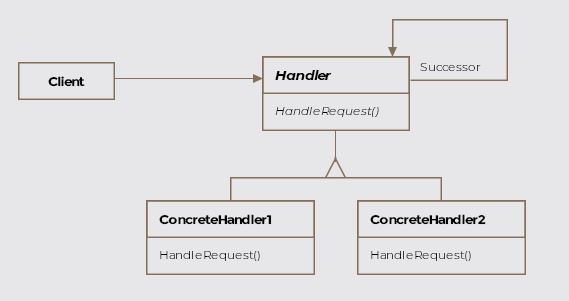
  <code>Class Diagram</code>
</div>
<br>

### Observer Pattern

Social media helps us immensely in understanding the observer pattern. If you are registered on Twitter then whenever you follow someone, you are essentially asking Twitter to send you (the observer) tweet updates of the person (the subject) you followed. The pattern consists of two actors, the observer who is interested in the updates and the subject who generates the updates.

<br>
<div align="center">
  <br>
  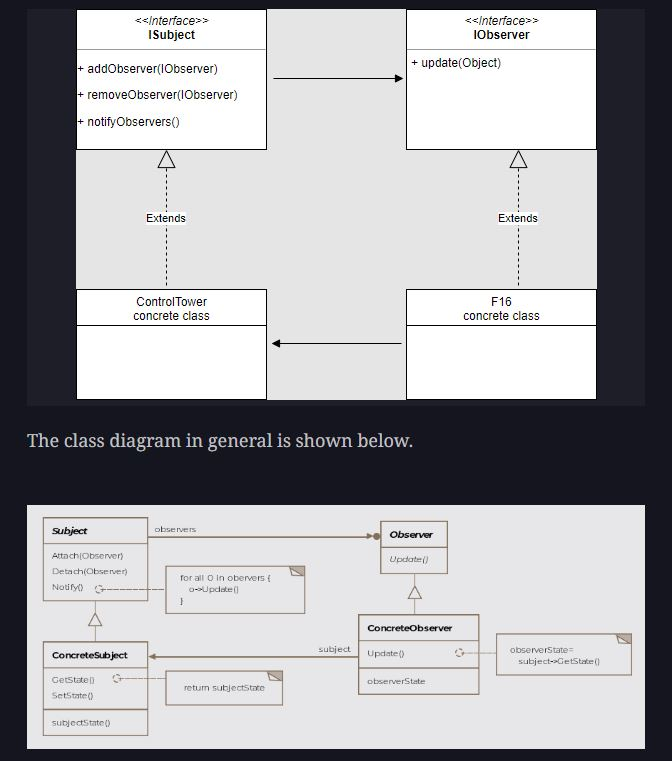
  <code>Class Diagram</code>
</div>
<br>

### Interpreter Pattern

The interpreter literally means a translator, someone who can convert from one form of speech to a another. The interpreter pattern converts a language's sentences into its grammar and interprets them.

Understanding the interpreter pattern requires background knowledge in automata and theory of computation. We'll briefly go over some of the concepts required to understand the pattern.

<br>
<div align="center">
  <br>
  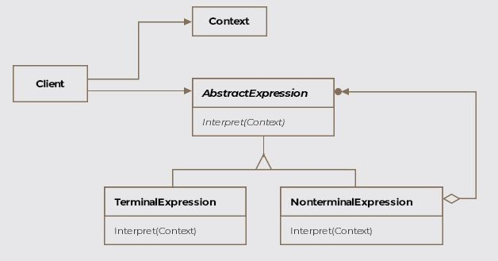
  <code>Class Diagram</code>
</div>
<br>

<b>Other Examples</b>

* java.util.Pattern is a compiled representation of a regular expression.

* java.text.Normalizer provides functionality to transform Unicode text.

### Command Pattern

representing an action or a request as an object that can then be passed to other objects as parameters, allowing parameterization of clients with requests or actions. The requests can be queued for later execution or logged. Logging requests enables undo operations.

<br>
<div align="center">
  <br>
  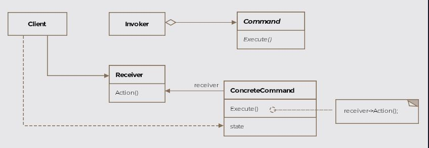
  <code>Class Diagram</code>
</div>
<br>

### Iterator Pattern

Iterate literally means to perform repeatedly. A for loop iterates over an array i.e. it accesses the array repeatedly. If you are familiar with Java then you would already have come across this pattern while working with Java Collections. A brief demonstration is below.

```java
ArrayList<String> companiesIWantToInterviewFor = new ArrayList<>();
 companiesIWantToInterviewFor.add("SnapChat");
 companiesIWantToInterviewFor.add("Twitter");
 companiesIWantToInterviewFor.add("Tesla");

 Iterator<String> it = companiesIWantToInterviewFor.iterator();
 while (it.hasNext()) {
     System.out.println(it.next());
 }
```

pattern that allows traversing the elements of an aggregate or a collection sequentially without exposing the underlying implementation.

<br>
<div align="center">
  <br>
  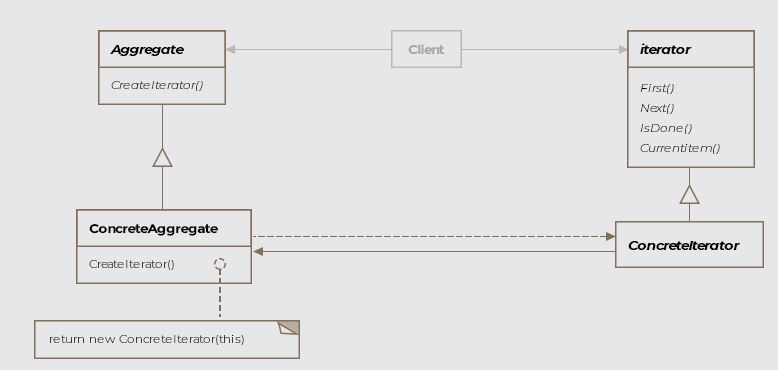
  <code>Class Diagram</code>
</div>
<br>

### Mediator Pattern

encouraging loose coupling among interacting objects by encapsulating their interactions in a mediator object, thus avoiding the need for individual objects to refer to each other directly and allowing to vary object interactions independently.

<br>
<div align="center">
  <br>
  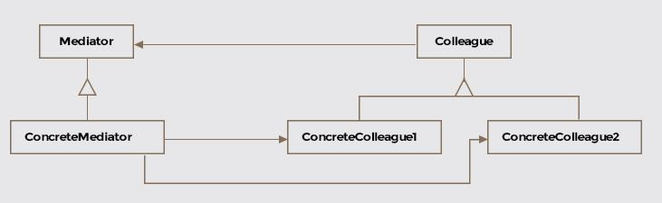
  <code>Class Diagram</code>
</div>
<br>

### Memento Pattern

The literal meaning of memento is an object kept as a reminder or souvenir of a person or an event. The memento pattern <code>let's us capture the internal state of an object without exposing its internal structure so that the object can be restored to this state later</code>. In some sense we are saving a token or a memento of the original object and then recreating the object's state using the memento at a later time.

<br>
<div align="center">
  <br>
  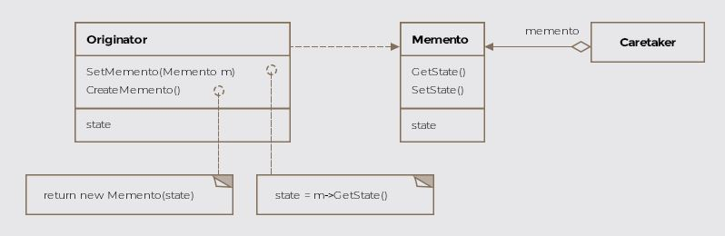
  <code>Class Diagram</code>
</div>
<br>

### State Pattern

The state pattern will be reminiscent of automata class from your undergraduate degree as it involves state transitions for an object. The state pattern encapsulates the various states a machine can be in. The machine or the context, as it is called in pattern-speak, can have actions taken on it that propel it into different states. Without the use of the pattern, the code becomes inflexible and littered with if-else conditionals.

Formally, the pattern is defined as <code>allowing an object to alter behavior when its internal state changes so that it appears to change its class.</code>

<br>
<div align="center">
  <br>
  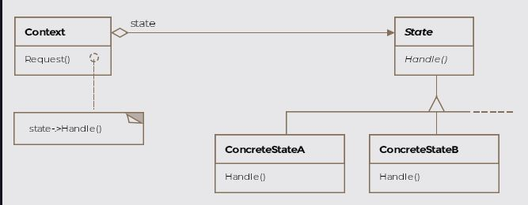
  <code>Class Diagram</code>
</div>
<br>

### Template Method

A template can be thought of as a general or abstract structure that can be customized for specific situations. You may have used a template for writing your resume. The template would define the overall structure of the document and leave the details to be added in by the template user. The template method pattern is similar, it defines the skeleton or steps of an algorithm but leaves opportunities for subclasses to override some of the steps with their own implementations.

Formally, the pattern is defined as <code>allowing subclasses to define parts of an algorithm without modifying the overall structure of the algorithm.</code>

<br>
<div align="center">
  <br>
  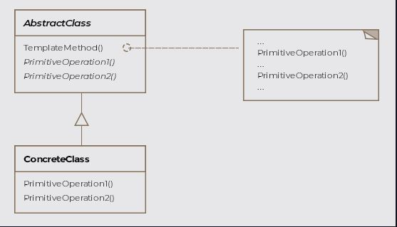
  <code>Class Diagram</code>
</div>
<br>

### Strategy Pattern

The strategy pattern is one of the simpler patterns to comprehend. It allows grouping related algorithms under an abstraction, which the client codes against. The abstraction allows switching out one algorithm or policy for another without modifying the client.

The strategy pattern is formally defined as <code>encapsulating algorithms belonging to the same family and making them interchangeable. The consumers of the common interface that the algorithms implement allow switching out one algorithm for another seamlessly.</code>

<br>
<div align="center">
  <br>
  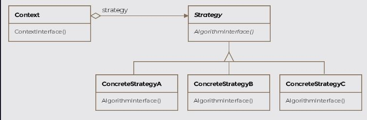
  <code>Class Diagram</code>
</div>
<br>

### Visitor Pattern

The visitor pattern allows us to define an operation for a class or a class hierarchy without changing the classes of the elements on which the operation is performed.

Formally, the pattern is defined as <code>defining operations to be performed on elements of an object structure without changing the classes of the elements it works on.</code>

<br>
<div align="center">
  <br>
  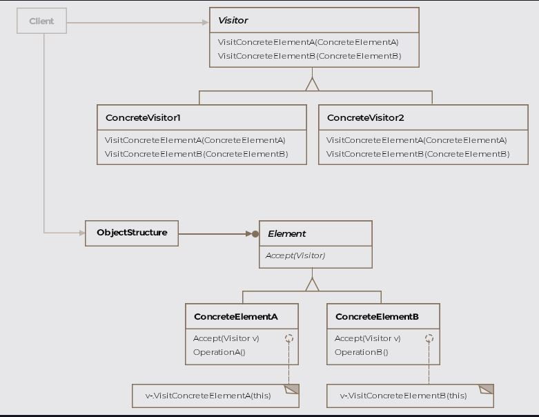
  <code>Class Diagram</code>
</div>
<br>

## Summary


| Pattern	| Purpose |
| :-------------- | --------------: |
| Builder Pattern | The builder pattern is used to create objects. It seperates out how the object is represented and how it is created. Additionally, it breaks down the creation into multiple steps. For instance in Java the <code>java.lang.StringBuilder</code> is an example of the builder pattern. |
| Singleton Pattern | The singleton pattern is applied to restrict instantiation of a class to only one instance. For instance in the Java language the class <code>java.lang.Runtime</code> is a singleton. |
| Prototype Pattern | Prototype pattern involves creating new objects by copying existing objects. The object whose copies are made is called the prototype. In Java the <code>clone()</code> method of <code>java.lang.Object</code> is an example of this pattern. |
| Factory Method Pattern | The factory method is defined as providing an interface for object creation but delegating the actual instantiation of objects to subclasses. For instance the method <code>getInstance()</code> of the class <code>java.util.Calendar</code> is an example of a factory method pattern. |
| Abstract Factory | The abstract factory pattern is defined as defining an interface to create families of related or dependent objects without specifying their concrete classes.The abstract factory is particularly useful for frameworks and toolkits that work on different operating systems. For instance, if your library provides fancy widgets for the UI, then you may need a family of products that work on MacOS and a similar family of products that work on Windows. |
| Adapter Pattern | The Adapter pattern allows two incompatible classes to interoperate that otherwise can't work with eachother. Consider the method <code>asList()</code> offered by <code>java.util.Arrays</code> as an exampe of the adapter pattern. It takes an array and returns a list. |
| Bridge Pattern | The bridge pattern describes how to pull apart two software layers fused together in a single class hierarchy and change them into parallel class hierarchies connected by a bridge |
| Composite Pattern | The pattern allows you to treat the whole and the individual parts as one. The closest analogy you can imagine is a tree. The tree is a recursive data-structure where each part itself is a sub-tree except for the leaf nodes. |
| Decorator Pattern | The decorator pattern can be thought of as a wrapper or more formally a way to enhance or extend the behavior of an object dynamically. The pattern provides an alternative to subclassing when new functionality is desired. A prominent example of this pattern is the <code>java.io</code> package, which includes several decorators. For example the <code>BufferedInputStream</code> wraps the <code>FileInputStream</code> to provide buffering capabilities. |
| Facade Pattern | The facade pattern is defined as a single uber interface to one or more subsystems or interfaces intending to make use of the subsystems easier |
| Flyweight Pattern | The pattern advocates reusing state among a large number of fine grained object. Methods <code>java.lang.Boolean.valueOf()</code> and <code>java.lang.Integer.valueOf()</code> both return flyweight objects. |
| Proxy Pattern | In a proxy pattern setup, a proxy is responsible for representing another object called the subject in front of clients. The real subject is shielded from interacting directly with the clients. The <code>java.rmi.*</code> package contains classes for creating proxies. RMI is Remote Method Invocation. It is a mechanism that enables an object on one Java virtual machine to invoke methods on an object in another Java virtual machine. |
| Chain of Responsibility Pattern | In a chain of responsibility pattern implementation, the sender's request is passed down a series of handler objects till one of those objects, handles the request or it remains unhandled and falls off the chain. Multiple objects are given a chance to handle the request. This allows us to decouple the sender and the receiver of a request. The <code>log()</code> method of the <code>java.util.logging.Logger</code> class is an example of this pattern. |
| Observer Pattern (Publisher/Subscriber) | The pattern is formally defined as a one to many dependency between objects so that when one object changes state all the dependents are notified. All types implementing the interface <code>java.util.EventListener</code> are examples of this pattern. |
| Interpreter Pattern | The interpreter pattern converts a language's sentences into its grammar and interprets them. |
| Command Pattern | The pattern is defined as representing an action or a request as an object that can then be passed to other objects as parameters, allowing parameterization of clients with requests or actions. The requests can be queued for later execution or logged. Logging requests enables undo operations. Types implementing the interface <code>java.lang.Runnable</code> are examples of this pattern. |
| Iterator Pattern | An iterator is formally defined as a pattern that allows traversing the elements of an aggregate or a collection sequentially without exposing the underlying implementation. All types implementing the <code>java.util.Iterator</code> interface are examples of this pattern. |
|Mediator Pattern | The pattern is applied to encapsulate or centralize the interactions amongst a number of objects. Object orientated design may result in behavior being distributed among several classes and lead to too many connections among objects. The encapsulation keeps the objects from referring to each other directly and the objects don't hold references to each other anymore. The <code>java.util.Timer</code> class represents this pattern where tasks may be scheduled for one-time execution, or for repeated execution at regular intervals in a background thread. |
| Memento Pattern | The memento pattern let's us capture the internal state of an object without exposing its internal structure so that the object can be restored to this state later. Classes implementing <code>java.io.Serializable</code> interface are examples of the memento pattern. |
| State Pattern | The state pattern encapsulates the various states a machine can be in. The machine or the context, as it is called in pattern-speak, can have actions taken on it that propel it into different states. Without the use of the pattern, the code becomes inflexible and littered with if-else conditionals. |
| Template Method | The template method pattern defines the skeleton or steps of an algorithm but leaves opportunities for subclasses to override some of the steps with their own implementations. Non-abstract methods of <code>java.util.AbstractList</code>, <code>java.util.AbstractSet</code> and <code>java.util.AbstractMap</code> are examples of this pattern. |
| Strategy Pattern | The pattern allows grouping related algorithms under an abstraction, which the client codes against. The abstraction allows switching out one algorithm or policy for another without modifying the client. <code>java.util.Comparator</code> has the method <code>compare()</code> which allows the user to define the algorithm or strategy to compare two objects of the same type. |
| Visitor Pattern | The visitor pattern allows us to define an operation for a class or a class hierarchy without changing the classes of the elements on which the operation is performed. The pattern is suitable in scenarios, where the object structure class or the classes that make up its elements don't change often but new operations over the object structure are desired. <code>java.nio.file.FileVisitor</code> interface has an implementation class of <code>SimpleFileVisitor</code> which is an example of a visitor. The interface is defined as a visitor of files. An implementation of this interface is provided to the <code>Files.walkFileTree()</code> methods to visit each file in a file tree. |
